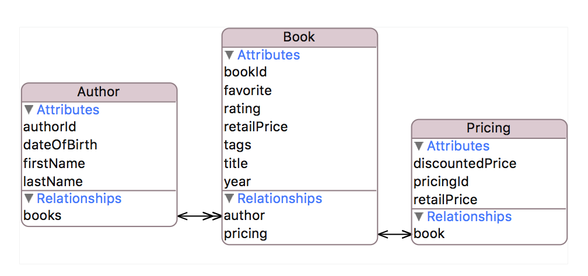

footer: Copyright © 2016, [About Objects, Inc.](http://www.aboutobjects.com)
slidenumbers: true


# [fit]_Streamlining_
# [fit]JSON Mapping
<br/>
#### Jonathan Lehr, Founder and VP, Training

---

## Things to Automate

```json
{ "book_id": 42,
  "title": "The Time Machine",
  "rating": 3 }
```
```swift
public class Book: NSObject {
    public var bookId: Int
    public var title: String?    
    public var rating: Rating?
}
```

1. Map **book_id** to **bookId**
2. Transform **rating** to Optional enum
3. Set properties of book to transformed values

---

## Object Graphs

```json
{ "author_id": 98,
  "first_name": "H. G.",
  "last_name": "Wells",
  "books": [
    { "book_id": 42,
      "title": "The Time Machine",
      "rating": 3 },
  ...    
```

1. Create nested **books** array
2. For each book dictionary:
    * Instantiate `Book`
    * Map values to `Book` properties

---

##  Object Graph in Memory


---

# Existing Solutions

---

## Popular Mapping Frameworks

**Developers define mappings programmatically by:**

* **RestKit** – passing dictionaries of mapping metadata per class
* **ObjectMapper**, **SwiftyJSON** – writing code to map individual properties

---

## Examples

---

## Issues

* Fragmented, implicit model is hard to visualize
* Significant maintenance effort
* JSON keys exposed as strings in Swift code

---

# A Thought Experiment

---

Assumptions:

* Many popular frameworks require mappings to be defined programmatically
* A few allow mappings to be externalized as plist metadata
* This may seem unrelated, but **most iOS teams don't seem to be using Core Data**

---
## So?

So naturally we wondered if it would be possible to use Xcode's awesome Core Data Model Editor to:

* Define a comprehensive set of mappings in a single, visible model
* Apply those mappings at runtime to non-Core Data objects

---

## Xcode's Model Editor

* Edits `xcdatamodel`
* Defines mappings between model objects and their external data representation
* Designed to support relational databases (object-relational mapping)
* **Model can be loaded as `NSManagedObjectModel` instance at runtime**

---

## Entities

* Metadata description of domain object
* Lists two kinds of properties: attributes and relationships
* Defines mapping between JSON dictionary and Swift class
* **Instances of `NSEntityDescription` in `NSManagedObjectModel`**

---

## Attributes

* Metadata descriptions of individual values
* Define mappings between data elements and Swift properties
* **Instances of `NSAttributeDescription` in `NSEntityDescription`**

---

## Relationships

* Describe properties that refer to model objects
* Specify destination entity name, and optional inverse relationship
* Can be *to-one* or *to-many*
* **Instances of `NSRelationshipDescripton` in `NSEntityDescription`**

---

# [fit] Demo: Xcode Model Editor

---

## Add a Dash of KVC, Then Stir

Back to the thought experiment, we wondered:

* Could a managed object model (MOM) fully describe JSON mappings? (Hint: duh!)
* Could we use Key-Value Coding (KVC) to automate encode/decode? (Hint: duh!)
* Could JSON + MOM + KVC = +1?

---

## So, What's KVC?

**Quick definition:**

> KVC is built-in `NSObject` behavior that allows you to treat an object like a dictionary.

**Quick example:**

```swift
// Set author's 'firstName' property to "Fred"
author.setValue("Fred", forKey: "firstName")

// Initialize 'name' with the value of the author's 'firstName' property
let name = author.value(forKey: "firstName")
```

---

#  The Modelmatic Framework

---

## Modelmatic Cocoapod

* ModelObject base class that uses MOM + KVC to encode/decode automatically
* Example app + unit tests illustrate usage

```swift
guard let entity = self.model.entitiesByName["Author"] else { return }
let dict1 = ["authorId": 123, "firstName": "Fred", "lastName": "Smith"]

// Encode
let author = Author(dictionary: dict1, entity: entity)

// Decode
let dict2 = author.dictionaryRepresentation
```

---

## KVC and Swift Types


**KVC handles automatically:**

* ObjC types, even if wrapped in Optionals 👍🏻
* Bridged Swift types (`String`, `Int`, etc.) 👍🏻

**KVC needs a little help with:**

* Bridged Swift types wrapped in Optionals 👎🏻
* Non-bridged Swift types 👎🏻

---

## Working with Swift Types

For non-Objc properties, add a computed property prefixed with **_kvc**, as shown below:

```swift
    var retailPrice: Double?

    var kvc_retailPrice: Double {
        get { return retailPrice ?? 0.0 }
        set { retailPrice = Optional(newValue) }
    }
```

---

## Customizing Key Paths

---

## Value Transformations

---

## Flattened Attributes

---

## Managing Relationships

* Setting to-one relationship values
* Adding values to to-many relationships

---

# Example App

---

## Object Store

* Accesses JSON via `NSURLSessionDataTask`
* Uses `NSURLProtocol` to intercept and access locally stored JSON
* Can switch modes to directly access local storage

---

## Example App Data Model



---

# [fit] Demo: Example App

---

# Benefits

* Comprehensive visual model
* Automates:
    * Object graph construction
    * Value transformation
    * Key path mappings
    * Flattening attributes
* Built-in model versioning

---

# Modelmatic + mogenerator

* **mogenerator** — command-line tool that generates base classes for Core Data entities
* Base classes can be regenerated whenever model changes
* Allows templates used for generating classes to be customized

---

## To Do:

* Lights-out property access for non-bridged types (dependent on Swift introspection)
* Add support for `NSManagedObject` subclasses
* Do clever things with model versions (TBD)
* Proposed: auto generate model from JSON

---

## Modelmatic Status

* Needs more unit tests
* Contributors welcome

---

# Q & A

---

# We're Hiring

### consultants with backgrounds in:
* iOS
* Android
* Middleware – Ruby and Java
* Backend – Java

---

#  Upcoming Classes
### Reston

#### 10/1 – 10/10  • iOS Development in Swift: Comprehensive
#### 10/1 – 10/10 • iOS Development in Objective-C: Comprehensive

### Cupertino

#### `10/1 – 10/10 ` • iOS Development in Swift: Comprehensive
#### `10/1 – 10/10 ` • iOS Development in Objective-C: Comprehensive

* View online: [Public schedule](www.aboutobjects.com/training/schedule.html)

