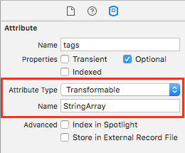
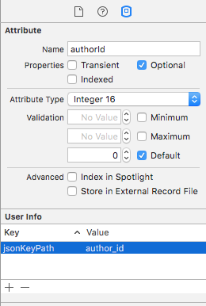
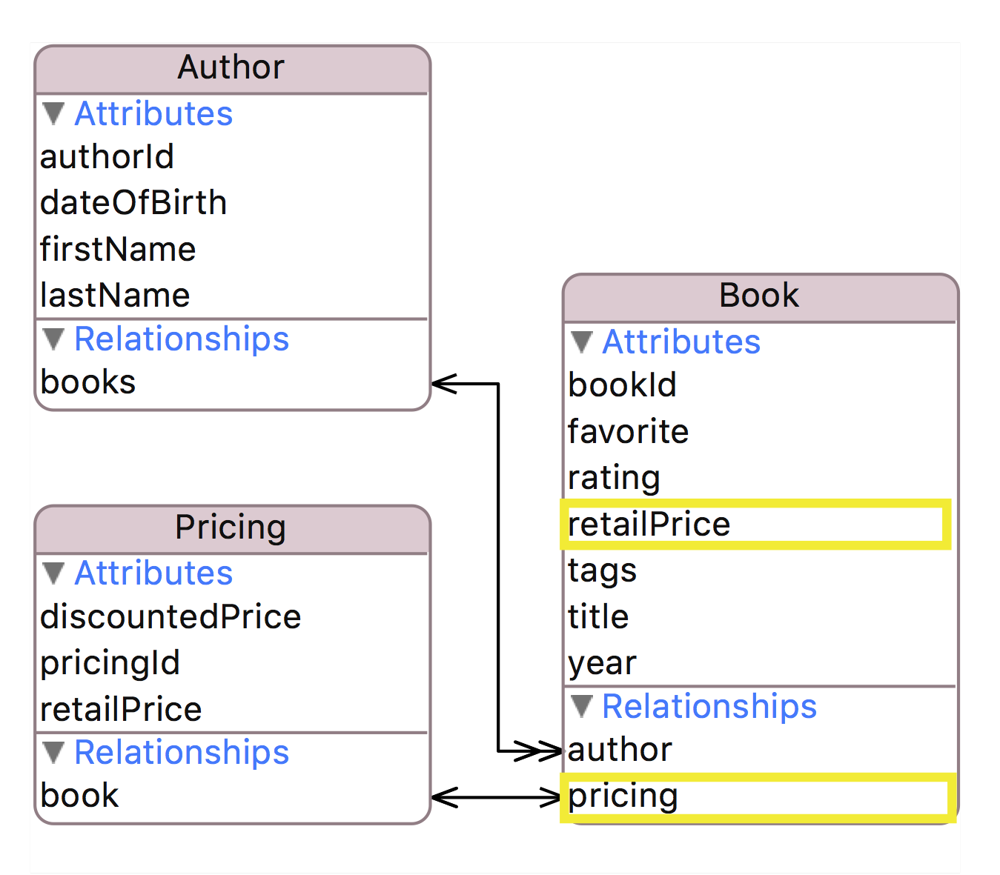
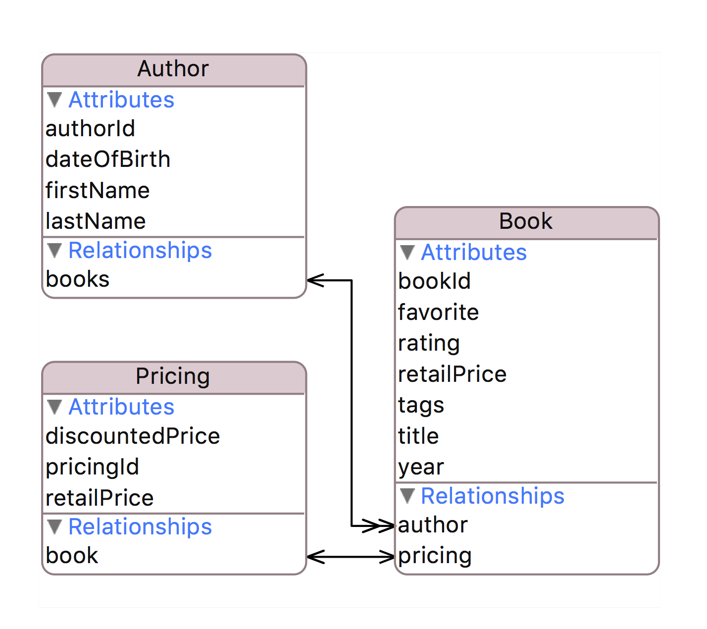

footer: Copyright © 2016, [About Objects, Inc.](http://www.aboutobjects.com)
slidenumbers: true


# [fit]_Streamlining_
# [fit]JSON Mapping
<br/>
#### Jonathan Lehr, Founder and VP, Training

---

## About Objects

* Reston, VA
* Full-stack consulting and training
* Roots in NeXT, OpenStep, WebObjects + enterprise middleware and backend
* iOS from day one

---

## [fit] So Many Frameworks

Number of hits yielded by a recent Github search for _swift json_:

### [fit] 576

Seems it's on a lot of peoples' radar.

---

## Automating Encode/Decode

```json
{ "book_id": 42,
  "title": "The Time Machine",
  "rating": 3 }
```
```swift
public class Book: NSObject {
    public var bookId: Int
    public var title: String?    
    public var rating: Rating?
}
```

1. Map keys to property names
2. Perform value transformations
3. Encode and decode model objects

<br/>


---
##  [fit] JSON <--> Object Graph

<br/>

```json
{ "author_id": 98,
  "first_name": "H. G.",
  "last_name": "Wells",
  "books": [
    { "book_id": 42,
      "title": "The Time Machine",
      "rating": 3 },
  ...    
```


---

## Mapping Frameworks

You define mappings programmatically by:

* Defining mappings per property in code (ObjectMapper, SwiftJSON)
* Providing dictionaries of mappings per class (RestKit)

---

## RestKit Example

```objectivec
    RKObjectMapping *bookMapping = [RKObjectMapping mappingForClass:Book.class];
    [bookMapping addAttributeMappingsFromDictionary:@{ 
        @"book_id": @"bookId",
        @"title": @"title",
        @"rating": @"rating",
    }];
    
    RKResponseDescriptor *descriptor = [RKResponseDescriptor 
        responseDescriptorWithMapping:bookMapping
        method:RKRequestMethodAny 
        pathPattern:nil
        keyPath:@"books"
        statusCodes:RKStatusCodeIndexSetForClass(RKStatusCodeClassSuccessful)];

```

---

## ObjectMapper Example

```swift
class Book: Mappable {
    public var bookId: Int
    public var title: String?    
    public var rating: Rating?

    required init?(_ map: Map) {

    }

    // Mappable
    func mapping(map: Map) {
        bookId <- map["book_id"]
        title <- map["title"]
        rating <- map["rating"]
    }
}
```

---

## Issues

* Maintenance is awkward
* Model hard to visualize
* Strings in code reduce safety

---

# The
# Modelmatic
# Framework


### [fit] www.github.com/AboutObjects/modelmatic

---

## Model Needs to Capture:

* Relationship info: to-many, target type
* Nice to have: inverse relationships
* Mapping keys to property names
* Value transformations

---

## Framework Needs to:

* Traverse relationships defined in model
* Construct nested objects
* Use introspection to get and set values
* Map keys and transform values

<br/>
**Do all the above without manual coding (except for custom transformations)**

---
## Core Data Model Editor

* Awesome tool for data modeling
* Defines mappings in a visual format
* Framework-level programmatic access

### But wait, it's only for Core Data, right?

Heh, heh

---
## Managed Object Model (MOM)

* Defines mappings between model objects and their external data representation
* Designed to support relational databases (object-relational mapping)
* **Can be loaded as `NSManagedObjectModel` instance at runtime**

---
## Entities

* Metadata description of domain object
* Lists two kinds of properties: attributes and relationships
* Defines mapping between JSON dictionary and Swift class
* **Instances of `NSEntityDescription` in `NSManagedObjectModel`**

---
## Attributes

* Metadata descriptions of individual values
* Define mappings between data elements and Swift properties
* **Instances of `NSAttributeDescription` in `NSEntityDescription`**

---

## Relationships

* Describe properties that refer to model objects
* Specify destination entity name, and optional inverse relationship
* Can be *to-one* or *to-many*
* **Instances of `NSRelationshipDescripton` in `NSEntityDescription`**

---

# [fit] Demo: Xcode Model Editor

---

## Encode/Decode Via KVC

**Quick definition:**

> KVC is built-in `NSObject` behavior that allows you to treat an object like a dictionary.

**Quick example:**

```swift
// Set author's 'firstName' property to "Fred"
author.setValue("Fred", forKey: "firstName")

// Initialize 'name' with the value of the author's 'firstName' property
let name = author.value(forKey: "firstName")
```

---

#  The Modelmatic Framework

---

## Modelmatic Cocoapod

* ModelObject base class
* Uses MOM + KVC to encode/decode
* Simple API
* Example app + unit tests show usage

---

## Subclassing

```swift
@objc (MDLAuthor)
class Author: ModelObject
{
    static let entityName = "Author"
    
    var authorId: NSNumber?
    var firstName: String?
    var lastName: String?
    
    // Strong reference to children, to-many relationship
    var books: [Book]?
}
```

---

## Basic Usage


```swift

// Decoding

let author = Author(dictionary: json, entity: entity)

// Encoding

let jsonDict = author.dictionaryRepresentation
```

---

## Modelmatic Example

```swift
// Assume we fetched JSON and deserialized it:
let json = ["author_id": 123, "first_name": "Fred", "last_name": "Smith", "books": [
        ["book_id": 234, "title": "Yadda, Yadda", "rating": 3],
        ["book_id": 456, "title": "Whee!", "rating": 5]
    ]
]

// Encode
let author = Author(dictionary: json, entity: entity)

// Work with the objects
author.firstName = "Frederick"
author.books[0]?.title = "War and Peace"

// Decode
let newJson = author.dictionaryRepresentation

// Contents of newJson:
```
```json
{ "author_id": 123, "first_name": "Frederick", "last_name": "Smith", "books": [
        { "book_id": 234, "title": "War and Peace", "rating": 3 },
        { "book_id": 456, "title": "Whee!", "rating": 5 }
    ]
}
```

---
## Managing Relationships

Setting to-one relationships

```swift
public func set(modelObject: ModelObject, forKey: String) throws
```

Adding objects to to-many relationships

```swift
public func add(modelObject: ModelObject, forKey: String) throws

public func add(modelObjects: [ModelObject], forKey: String) throws
```

---
## KVC and Swift Types

**KVC handles automatically:**

* ObjC types, even if wrapped in Optionals 👍🏻
* Bridged Swift types (`String`, `Int`, etc.) 👍🏻

**KVC needs a little help with:**

* Bridged Swift types wrapped in Optionals 👎🏻
* Non-bridged Swift types 👎🏻

---
## Working with Swift Types

For non-Objc properties, add a computed property prefixed with **_kvc**, as shown below:

```swift
    var retailPrice: Double?

    var kvc_retailPrice: Double {
        get { return retailPrice ?? 0.0 }
        set { retailPrice = Optional(newValue) }
    }
```

---
# Transforming 
# Values

To define custom transformation:

* Subclass `NSValueTransformer`
* Register subclass

```swift
NSValueTransformer.setValueTransformer(
    MyTransformer(),
    forName: MyTransformer.transformerName)
```

Apply to attributes by setting type to *Transformable*



---
## Value Transformer Example

```swift
private let delimiterString = ","

@objc (MDLStringArrayTransformer)
class StringArrayTransformer: NSValueTransformer
{
    static let transformerName = "StringArray"
    
    override class func transformedValueClass() -> AnyClass { return NSString.self }
    override class func allowsReverseTransformation() -> Bool { return true }
    
    override func transformedValue(value: AnyObject?) -> AnyObject? {
        guard let values = value as? NSArray else { return value }
        return values.componentsJoinedByString(delimiterString)
    }
    
    override func reverseTransformedValue(value: AnyObject?) -> AnyObject? {
        guard let stringVal = value as? String else { return nil }
        return stringVal.componentsSeparatedByString(delimiterString)
    }
}
```

---
# Mapping
# Key Paths


Set value for key *jsonKeyPath* in attribute's UserInfo dictionary



---
# Flattened
# Attributes

Preserving JSON structure during encoding requires modeled relationship.



---
# Example App

---

## Object Store

* Accesses JSON via `NSURLSessionDataTask`
* Uses `NSURLProtocol` to intercept and access locally stored JSON
* Can switch modes to directly access local storage

---
## Example App Data Model



---
## Sample JSON

```json
  "version" : 0,
  "authors" : [
    {
      "books" : [
        {
          "title" : "The Tempest",
          "year" : "2013",
          "tags" : "drama,fantasy",
          "pricing" : {
            "retail_price" : 14.99
          },
          "favorite" : true,
          "book_id" : "3001",
          "rating" : 4
        },
```

---
# [fit] Demo: Example App

---

# Modelmatic

* Comprehensive visual model
* Automates:
    * Object graph construction
    * Value transformation
    * Key path mappings
    * Flattening attributes
* Built-in model versioning

---

# Modelmatic + mogenerator

* **mogenerator** — command-line tool that generates base classes for Core Data entities
* Base classes can be regenerated whenever model changes
* Allows templates used for generating classes to be customized

---

## To Do:

* Testing and documentation
* Fully automate non-bridged types (dependent on Swift introspection)
* Add support for `NSManagedObject` subclasses
* Do clever things with model versions (TBD)
* Proposed: auto generate model from JSON

**Contributors welcome!**

---

# Q & A

---

# We're Hiring

### consultants with backgrounds in:
* iOS
* Android
* Middleware – Ruby and Java
* Backend – Java

---

#  Upcoming Classes
### Reston

#### 10/3 – 10/7  • Advanced iOS Development
#### 10/22 – 10/28 • iOS Development in Swift: Comprehensive
#### 12/10 – 12/16 • iOS Development in Objective-C: Comprehensive

### Cupertino

#### 11/21 – 11/22 • WatchKit Development
#### 1/30 – 2/3 • iOS Development in Swift: Comprehensive

* View online: [Public schedule](www.aboutobjects.com/training/schedule.html)

