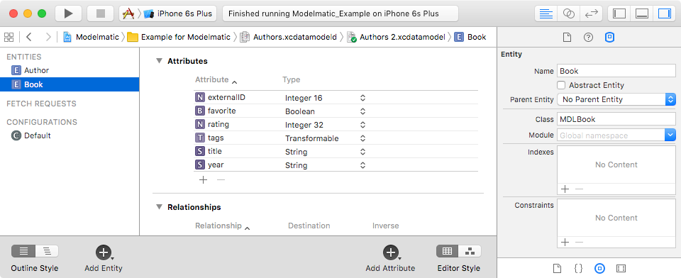

# Modelmatic

Automatic JSON serialization and deserialization for Swift model objects.

[](https://travis-ci.org/AboutObjects/Modelmatic)
[](http://cocoapods.org/pods/Modelmatic)
[](http://cocoapods.org/pods/Modelmatic)
[](http://cocoapods.org/pods/Modelmatic)

Modelmatic automates JSON serialization and deserialization of your app's model layer. Instead of requiring you to hand-maintain mappings in your Swift classes, Modelmatic reads mappings and value transformations you define in Xcode's Core Data Model Editor. 

Please note that the current version of Modelmatic works only for model objects that *don't* depend on Core Data. Support for `NSManagedObject` subclasses will be added in a future release.


*Image courtesy Christopher T. Howlett, the Noun Project*


## Usage

Modelmatic allows you to specify custom mappings between the key paths of JSON data elements and properties of your model objects. For example, suppose your app presents a book that you populate with data from a web service. The JSON might look something like this:

```json
{
  "tags" : "drama,fantasy",
  "title" : "The Tempest",
  "year" : "2013",
  "book_id" : "3001"
}
```

### Step 1: Creating the Model
In the Core Data Model Editor, you would create an entity named **Book**, and define any attributes you want to model:



You could then create a `Book` class similar to the following (Note that Xcode can generate base classes from Core Data entities, or you can use the awesome [mogenerator](https://github.com/rentzsch/mogenerator) for that purpose):

```swift
@objc (MDLBook)
public class Book: ModelObject
{
    public static let entityName = "Book"
    
    public var externalID: NSNumber!
    public var title: String!    
    public var year: String?
    public var tags: [String]?
    public var author: Author?
```

#### Customizing Mappings

TODO:

#### Defining Relationships

TODO:

#### Specifying Value Transformation

The framework also automatically applies any value transformers (instances of `NSValueTransformer` subclasses) you specify in your model.

TODO: Add example

### Step 2: Loading the Model

Somewhere in your app (you only need to do this once during the app's lifecycle), do something like the following to load the model you created earlier into memory:

```swift
let modelName = "MyModel"
    
guard let modelURL = NSBundle(forClass: Book.self).URLForResource(modelName, withExtension: "momd"),
    model = NSManagedObjectModel(contentsOfURL: modelURL) else {
        print("Unable to load model \(modelName)")
        return
}
```

You'll most likely want to store the reference to the model in a class property.

### Step 3: Deserializing Data and Decoding

Once you've obtained JSON data, you can deserialize it as follows (Note that this simply wraps a call to `NSJSONSerialization`):

```swift
guard let bookDict = try? data.deserializeJson() else {
    return
}
```
To construct an instance of your model class, simply provide the dictionary of deserialized values, along with the entity description:

```swift
let bookObj = Book(dictionary: bookDict, entity: entity)
```

This will construct and populate an instance of `Book`, as well as any nested objects for which you defined relationships in the model (and for which the JSON contains data).

### Step 4: Encoding and Serializing

You can then simply work with the model objects in your app. Whenever you want to serialize an object or group of objects, 

```swift
// Decode model object(s)
let bookDict = bookObj.dictionaryRepresentation
    
// Serialize data
if let data = try? NSJSONSerialization.dataWithJSONObject(bookDict, options: NSJSONWritingOptions(rawValue: 0)) {
    // Do something with the data...
}
```

## Example

To run the example project, clone the repo, and run `pod install` from the Example directory first.

## Requirements

* Swift 2.3 and iOS 8.3 (or greater)
* Core Data (CoreData.framework)

## Installation

Modelmatic is available through [CocoaPods](http://cocoapods.org). To install
it, simply add the following line to your Podfile:

```ruby
pod "Modelmatic"
```

## Changelog

[CHANGELOG.md](CHANGELOG.md)

## Author

Jonathan Lehr, jonathan@aboutobjects.com

## License

Modelmatic is available under the MIT license. See the LICENSE file for more info.
