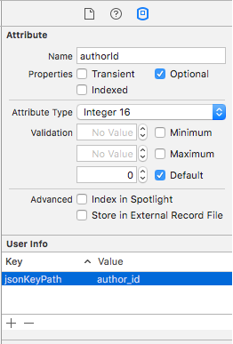

# Modelmatic

Automatic JSON encoding and decoding of Swift (and eventually Objective-C) model objects.

[](https://travis-ci.org/AboutObjects/Modelmatic)
[](http://cocoapods.org/pods/Modelmatic)
[](http://cocoapods.org/pods/Modelmatic)
[](http://cocoapods.org/pods/Modelmatic)

Modelmatic automates JSON encoding and decoding of your app's model layer. Instead of requiring you to hand-maintain mappings in your Swift (and eventually Objective-C) classes, Modelmatic reads mappings and value transformations you define in Xcode's Core Data Model Editor. 

Please note that the current version of Modelmatic works only for model objects that *don't* depend on Core Data. Support for `NSManagedObject` subclasses will be added in a future release.


*Image courtesy Christopher T. Howlett, the Noun Project*


## Usage

Modelmatic allows you to specify custom mappings between key-value pairs in JSON dictionaries, and corresponding properties of your model objects. For example, suppose you're working with JSON similar to the following (from the Modelmatic example app):

```json
{
  "version" : "2",
  "batchSize" : "10",
  "authors" : [
    {
      "firstName" : "William",
      "lastName" : "Shakespeare",
      "born" : "1564-04-01",
      "author_id" : "101",
      "imageURL" : "https:\/\/www.foo.com?id=xyz123",
      "books" : [
        {
          "tags" : "drama,fantasy",
          "title" : "The Tempest",
          "year" : "2013",
          "book_id" : "3001"
        },
        ...
```

### Step 1: Defining the Model

To use Modelmatic, you start by modeling your data using Xcode's [Core Data Model Editor](https://developer.apple.com/library/mac/documentation/Cocoa/Conceptual/CoreData/KeyConcepts.html). Don't worry, you're not going to need to use other aspects of Core Data, just the data model -- and just a subset of it's capabilities.


### Step 2: Create Swift Classes

If your model is complex, and/or changes frequently, consider using [mogenerator](https://github.com/rentzsch/mogenerator) to generate model classes (and update them as needed) from the metadata you specified in the model editor. Otherwise, it's simplest to just create the classes you need from scratch. Here's an example:

```swift
import Foundation
import Modelmatic

@objc (MDLAuthor)
 class Author: ModelObject
{
    // Name of the Core Data entity
    static let entityName = "Author"
    
    // Mapped to 'author_id' in the corresponding attribute's User Info dictionary
    var externalID: NSNumber!
    var firstName: String?
    var lastName: String?
    var dateOfBirth: NSDate?
    var imageURL: UIImage?
    
    // Modeled relationship to 'Book' entity
    var books: [Book]?
}
```

Key points:

* import `Modelmatic`.
* Subclass `ModelObject`.
* Use `@objc()` to avoid potential namespacing issues.
* Define a static let constant named `entityName` to specify the name of the associated entity in the Core Data model file.
* `externalID` is mapped to `author_id` in the model (see the attribute definition's User Info dictionary).
  
  
* Modelmatic automatically maps all the other properties, included the nested `books` property.

#### Customizing Mappings

Modelmatic automatically matches names of properties you specify as attributes or relationships in your Core Data model to corresponding keys in the JSON dictionary. For example, given an attribute named `firstName`, Modelmatic will try to use `firstName` as a key in the JSON dictionary, and map it to a `firstName` property in `Author`.

However, the framework also allows you to specify custom mappings as needed. For instance, the `Author` class has the following property:

```swift
    var externalID: NSNumber!
``` 

A custom mapping is provided in the model file, binding the `externalID` attribute defines to the JSON key path `author_id`, as shown below:


To add a custom mapping, select an attribute or relationship in the model editor, and add an entry to it's *User Info* dictionary. The key should be **externalKeypath**, and the value should be the key or key path (dot-separated property path) used in the JSON dictionary. During encoding and decoding, Modelmatic will automatically map between your object's property, as defined by its attribute or relationship name, and the custom key path you specified to access JSON values.


#### Defining Relationships

Core Data allows you to define one-to-one and one-to-many relationships between entities. Modelmatic will automatically create and populate nested objects for which you've defined relationships. For instance, the Modelmatic example app defines a one-to-many relationship from the `Author` entity to the `Book` entity. To create an `Author` instance along with its nested array of books, you simply initialize an `Author` with a JSON dictionary as follows:

```swift
let author = Author(dictionary: $0, entity: entity)
```

For example, given the following JSON, the previous call would create and populate an instance of `Author` containing an array of two `Book` objects, with their `author` properties set to point back to the `Author` instance):

```json
{
      "author_id" : "106"
      "firstName" : "Mark",
      "lastName" : "Twain",
      "books" : [
        {
          "book_id" : "3501",
          "title" : "A Connecticut Yankee in King Arthur's Court",
          "year" : "2014"
        },
        {
          "book_id" : "3502",
          "title" : "The Prince and the Pauper",
          "year" : "2015"
        }
      ],
    }
```

#### Property Types

Modelmatic uses methods defined in the `NSKeyValueCoding` (KVC) protocol to set model object property values. KVC can set properties of any Objective-C type, but has limited ability to deal with pure Swift types, particularly struct and enum types. However bridged Standard Library types, such as `String`, `Array`, `Dictionary`, as well as scalar types such as `Int`, `Double`, `Bool`, etc. are handled automatically by KVC with one notable issue: Swift scalars wrapped in Optionals. For example, KVC would be unable to set the following property:

```swift
    var rating: Int?
```
If your `ModelObject` subclasses uses a Swift type that KVC can't directly handle, you can provide a computed property of the same name, prefixed with `kvc_`, to provide your own custom handling. For example, to make the `rating` property work with Modelmatic, add the following:

```swift
    var kvc_rating: Int {
        get { return rating ?? 0 }
        set { rating = Optional(newValue) }
    }
```
If Modelmatic is unable to set a property directly (in this case the `rating` property), it will automatically call the `kvc_` prefixed variant (`kvc_rating`, in this example).

#### Specifying Value Transformations

In your Core Data model file, you can specify a property type as `Transformable`. If you do so, you can then provide the name of a custom transformer. For example, the `Author` class in the Modelmatic example app has a transformable property, `dateOfBirth`, of type `NSDate`. Modelmatic automatically uses an instance of the specified `NSValueTransformer` subclass to transform the value when accessing the property.

Here's the code of the Example app's `DateTransformer` class in its entirety:

```swift
import Foundation

@objc (MDLDateTransformer)
class DateTransformer: NSValueTransformer
{
    static let transformerName = "Date"
    
    override class func transformedValueClass() -> AnyClass { return NSString.self }
    override class func allowsReverseTransformation() -> Bool { return true }
    
    override func transformedValue(value: AnyObject?) -> AnyObject? {
        guard let date = value as? NSDate else { return nil }
        return serializedDateFormatter.stringFromDate(date)
    }
    
    override func reverseTransformedValue(value: AnyObject?) -> AnyObject? {
        guard let stringVal = value as? String else { return nil }
        return serializedDateFormatter.dateFromString(stringVal)
    }
}

private let serializedDateFormatter: NSDateFormatter = {
    let formatter = NSDateFormatter()
    formatter.dateFormat = "yyyy-MM-dd"
    return formatter
}()
```

The date transformer is registered by the following line of code in the Example app's `AuthorObjectStore` class:

```swift
NSValueTransformer.setValueTransformer(DateTransformer(), forName: String(DateTransformer.transformerName))
```

### Step 3: Loading the Model

Somewhere in your app (you only need to do this once during the app's lifecycle), do something like the following to load the Core Data model file into memory:

```swift
let modelName = "Authors"
    
guard let modelURL = NSBundle(forClass: self.dynamicType).URLForResource(modelName, withExtension: "momd"),
    model = NSManagedObjectModel(contentsOfURL: modelURL) else {
        print("Unable to load model \(modelName)")
        return
}
```

You'll most likely want to store the reference to the model in a class property.

### Step 4: Encoding and Decoding Model Objects

Once you've obtained JSON data, you can deserialize it as follows (Note that `deserializeJson` wraps a call to `NSJSONSerialization`):

```swift
guard let data = data, dict = try? data.deserializeJson() else { 
    return
}
```
To construct an instance of your model class, simply provide the dictionary of deserialized values, along with the entity description:

```swift
let authors = Author(dictionary: $0, entity: entity)
```

This will construct and populate an instance of `Author`, as well as any nested objects for which you defined relationships in the model (and for which the JSON contains data). You then simply work with your model objects. Whenever you want to serialize an object or group of objects, simply do as follows:

```swift
// Encode the author
let authorDict = author.dictionaryRepresentation
    
// Serialize data
if let data = try? dict.serializeAsJson(pretty: true) {
    // Do something with the data...
}
```

## Example

To run the example project, clone the repo, and run `pod install` from the Example directory first.

## Requirements

* Swift 2.3 and iOS 8.3 (or greater)
* Core Data (CoreData.framework)

## Installation

Modelmatic is available through [CocoaPods](http://cocoapods.org). To install
it, simply add the following line to your Podfile:

```ruby
pod "Modelmatic"
```

## Changelog

[CHANGELOG.md](CHANGELOG.md)

## Author

Jonathan Lehr, jonathan@aboutobjects.com

## License

Modelmatic is available under the MIT license. See the LICENSE file for more info.
